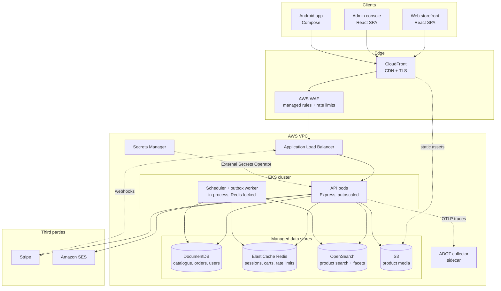
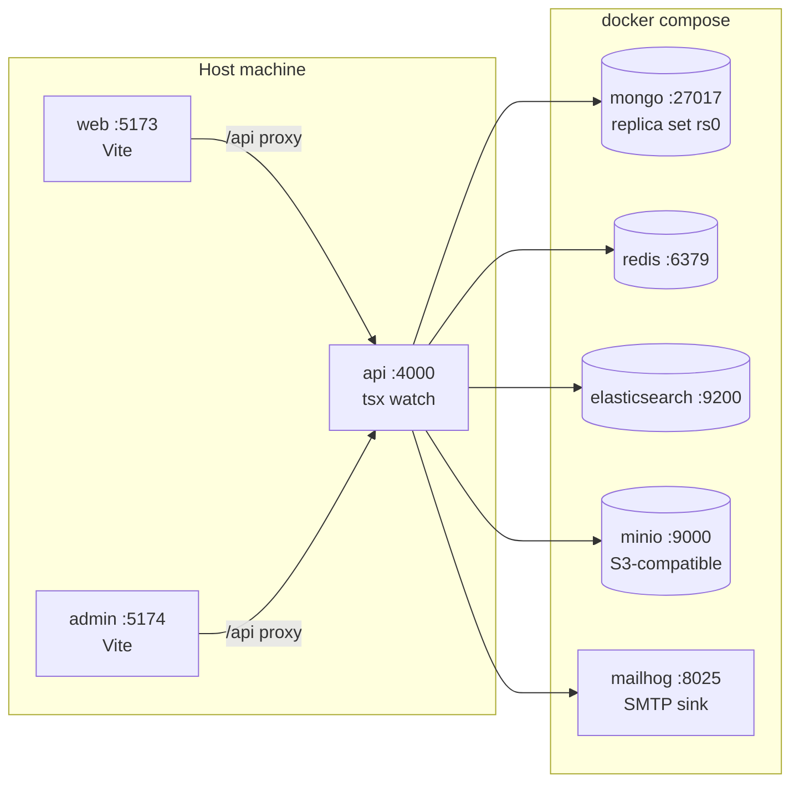
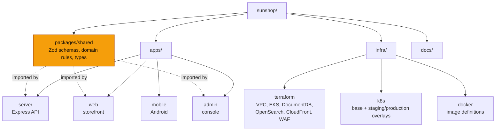
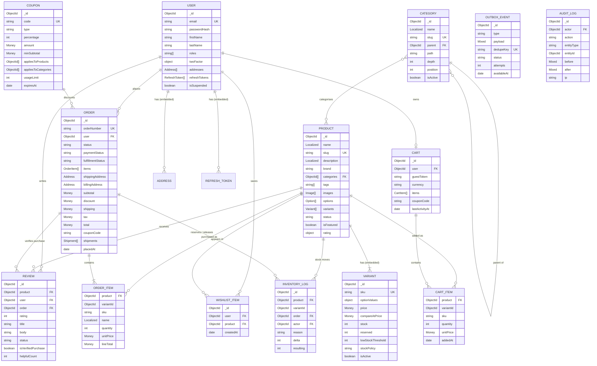
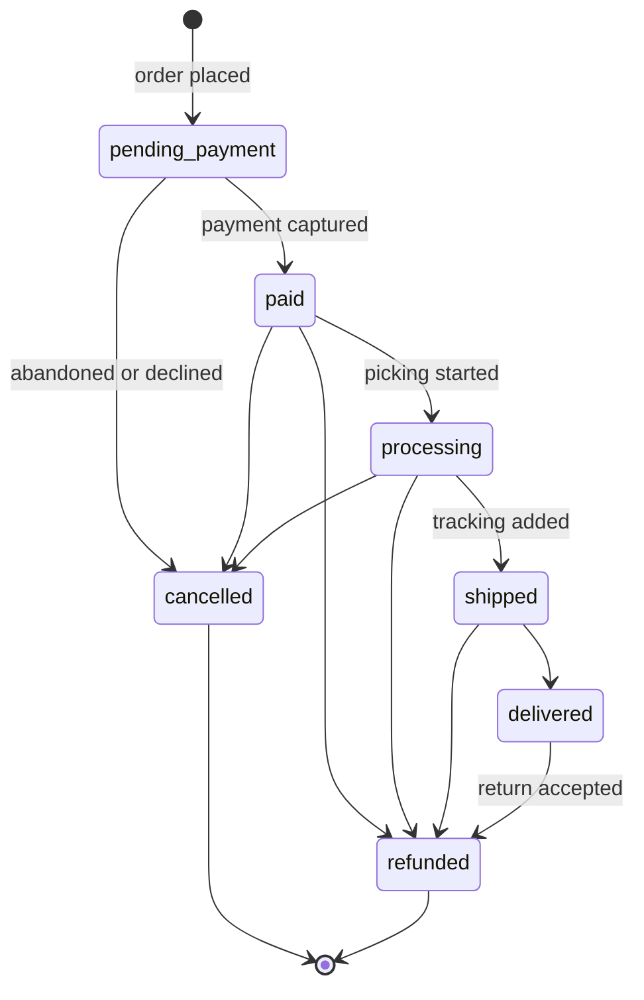
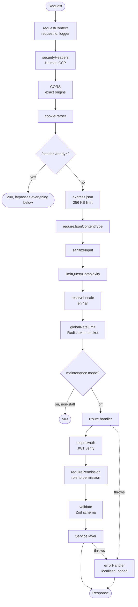
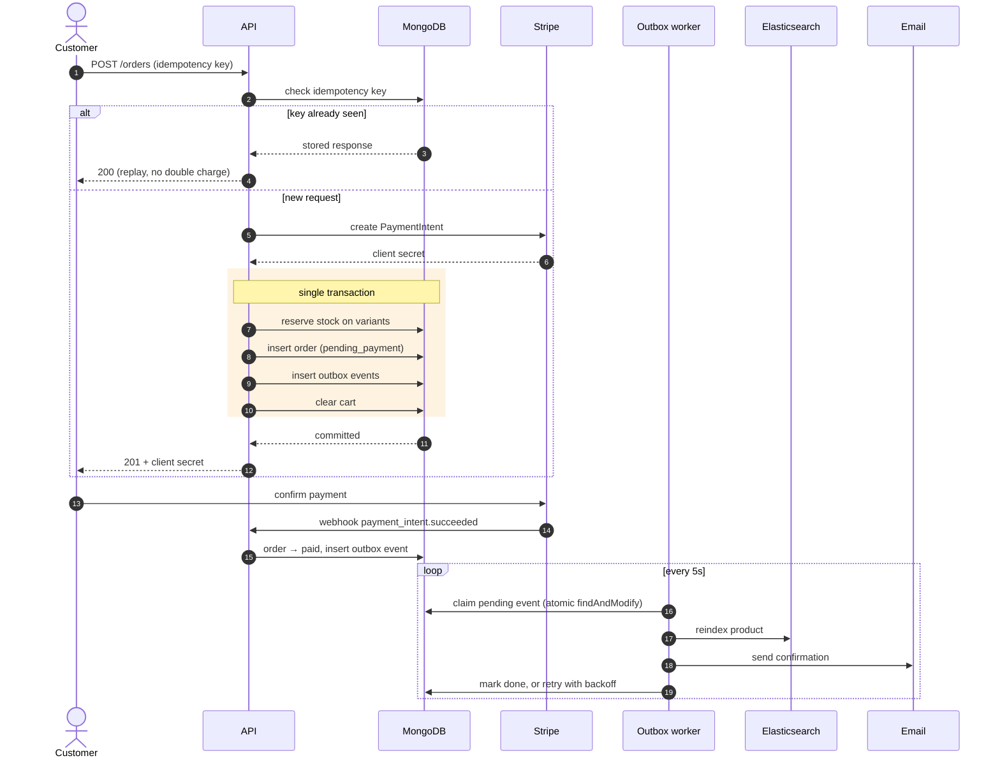
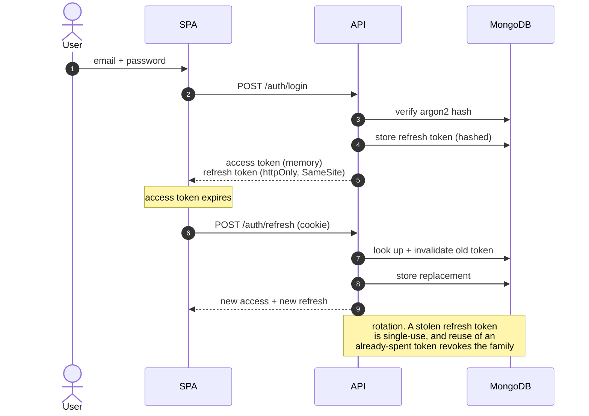
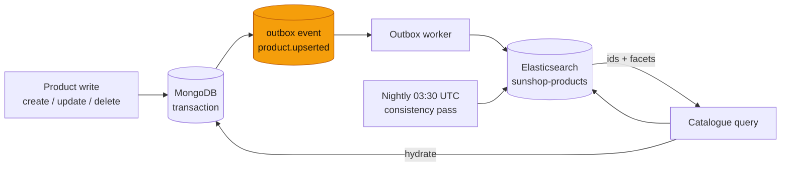
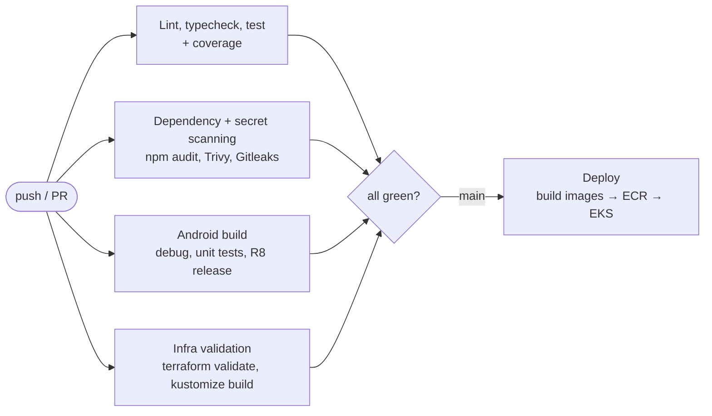

# Sunshop

A production-shaped e-commerce platform built as a TypeScript monorepo: a REST API, a bilingual storefront, a staff admin console, a native Android client, and the Terraform and Kubernetes needed to run it on AWS.

Everything is bilingual English/Arabic with full RTL support, and prices are handled as integer minor units end to end.

| Workspace         | Stack                                       | What it is                                                |
| ----------------- | ------------------------------------------- | --------------------------------------------------------- |
| `apps/server`     | Express 4, Mongoose 8, Redis, Elasticsearch | REST API, background jobs, OpenAPI spec                   |
| `apps/web`        | React 18, Vite, TanStack Query, Tailwind    | Customer storefront                                       |
| `apps/admin`      | React 18, Vite, Recharts, Tailwind          | Staff console                                             |
| `apps/mobile`     | Kotlin, Jetpack Compose, Hilt, Retrofit     | Native Android client                                     |
| `packages/shared` | Zod, TypeScript                             | Schemas, domain rules and types shared by every workspace |
| `infra`           | Terraform, Kustomize, Docker                | AWS infrastructure and deployment manifests               |

---

## Contents

- [System architecture](#system-architecture)
- [Local development topology](#local-development-topology)
- [Repository layout](#repository-layout)
- [Database design](#database-design)
- [Order lifecycle](#order-lifecycle)
- [Request lifecycle](#request-lifecycle)
- [Checkout and the outbox](#checkout-and-the-outbox)
- [Authentication](#authentication)
- [Search indexing](#search-indexing)
- [Getting started](#getting-started)
- [Testing and CI](#testing-and-ci)

---

## System architecture

Production runs on EKS behind CloudFront. The API is stateless; every piece of state lives in DocumentDB, ElastiCache, OpenSearch or S3, so pods can be replaced at will.



**Why these pieces**

- **Stateless API.** Sessions live in Redis and refresh tokens in the database, so no pod holds anything worth preserving.
- **Search is a projection, not the source of truth.** MongoDB owns product data; OpenSearch is rebuilt from it and may be dropped at any time.
- **Secrets never sit in manifests.** The External Secrets Operator pulls from Secrets Manager into Kubernetes at runtime.
- **Two proxy hops.** ALB then ingress, so Express is configured to trust exactly two. Trusting all of them would let a client spoof `X-Forwarded-For` past rate limiting.

---

## Local development topology

`docker compose up -d` starts the backing services; `npm run dev` runs the three JS apps with hot reload against them.



Mongo runs as a **single-node replica set** rather than a standalone, because checkout and inventory reservation use transactions. Developing without them would hide a whole class of bug until production.

Vite proxies `/api` to the API so the browser sees one origin and cookies work without relaxing `SameSite`.

---

## Repository layout



`packages/shared` is the reason the stack holds together: one Zod schema defines a product, and the API validates against it while both front ends infer their types from it. A field renamed in one place fails to compile in the others.

---

## Database design

MongoDB, accessed through Mongoose. Money is stored everywhere as `{ amount: Int, currency: String }` in **minor units**, never a float.



### Modelling decisions worth knowing

**Variants are embedded in the product, not a separate collection.** A product and its variants are always read together, and a product is the natural transaction and consistency boundary. The trade-off is a document size ceiling, which is fine for a catalogue where a product has tens of variants, not thousands.

**Order items copy the product name and price at purchase time.** They are not references. A price change or a renamed product must never rewrite what a customer already bought, and an order has to stay readable after a product is deleted.

**Stock is `stock` minus `reserved`, not one number.** Adding to cart reserves; the reservation expires if checkout is abandoned. A single counter cannot distinguish "sold" from "in someone's cart for the next fifteen minutes".

**Categories store a materialised `path` and `depth`.** Breadcrumbs and "everything under Menswear" become one indexed prefix query rather than a recursive walk.

**`OUTBOX_EVENT` exists so side effects are transactional.** Explained under [Checkout and the outbox](#checkout-and-the-outbox).

**`AUDIT_LOG` keeps before/after snapshots** so a staff action can be reconstructed, not merely listed.

---

## Order lifecycle

The state machine lives in `packages/shared` and both the API and the admin UI read the same table, so the console cannot offer a transition the API will reject.



Cancelling or refunding releases the stock reservation and writes an `INVENTORY_LOG` entry, so the ledger explains every movement.

---

## Request lifecycle

Middleware order is deliberate: cheap rejections happen before expensive work, and the health probes sit ahead of rate limiting so a throttled API still reports honestly to Kubernetes.



Errors leave through one handler that returns a stable machine-readable `code` plus a message localised to the request's locale. Clients branch on the code; humans read the message.

---

## Checkout and the outbox

Placing an order writes several documents and needs to trigger side effects: email, search reindex, analytics. Doing that work inline would mean an order that succeeded but whose confirmation email failed, or a transaction held open across a third-party call.

Instead the side effects are written as events **inside the same transaction** as the order, then drained separately.



If the process dies mid-drain the event stays `pending` and is retried; if a handler keeps failing the event lands in a dead-letter state rather than blocking the queue. The order and its side effects can never disagree, because they were committed together.

---

## Authentication

Short-lived access tokens in memory, long-lived refresh tokens in a rotating httpOnly cookie. The access token is deliberately **never** written to `localStorage`, which would trade XSS resistance for a one-line "stay signed in".



Roles map to permissions in `packages/shared`, and routes declare the permission they need rather than the role, so adding a role does not mean auditing every route.

---

## Search indexing

Search is a projection of MongoDB. It is never written directly by a request.



The nightly reindex is a safety net: the outbox keeps the index current, but a dead-lettered event would otherwise let the index drift silently for weeks.

---

## Getting started

**Requirements:** Node 22.12+, Docker, and (for the Android app) JDK 21 with the Android SDK.

```bash
git clone git@github.com:ahmedselimmansor-ctrl/Sunshop-e-ccomerce-MERN-stack.git
cd Sunshop-e-ccomerce-MERN-stack

cp .env.example .env          # dev defaults work as-is
npm ci
docker compose up -d          # mongo, redis, elasticsearch, minio, mailhog
npm run seed -w @sunshop/server
npm run dev
```

| Service             | URL                        |
| ------------------- | -------------------------- |
| Storefront          | http://localhost:5173      |
| Admin console       | http://localhost:5174      |
| API                 | http://localhost:4000      |
| OpenAPI docs        | http://localhost:4000/docs |
| Mail sink (MailHog) | http://localhost:8025      |
| MinIO console       | http://localhost:9001      |

Every host port is overridable in `.env` (`REDIS_HOST_PORT`, `MAIL_UI_HOST_PORT`, and so on) for machines where another project already holds the default.

Seeded demo accounts, development only:

| Role              | Email                   | Password       |
| ----------------- | ----------------------- | -------------- |
| Admin             | `admin@sunshop.demo`    | `Sunshop!2026` |
| Catalogue manager | `catalog@sunshop.demo`  | `Sunshop!2026` |
| Customer          | `customer@sunshop.demo` | `Sunshop!2026` |

### Android

```bash
cd apps/mobile
./gradlew assembleDebug
```

The debug build points at `10.0.2.2:4000`, which is the host machine as seen from the Android emulator.

---

## Testing and CI

```bash
npm run lint          # eslint, zero warnings tolerated
npm run typecheck     # tsc across every workspace
npm test              # vitest
npm run build         # all workspaces
```

Every push runs four jobs:



The Android job builds the release variant as well as debug, because R8 and resource shrinking fail on problems a debug build never sees.

---

## Documentation

| Document                                               | Contents                                      |
| ------------------------------------------------------ | --------------------------------------------- |
| [docs/architecture.md](docs/architecture.md)           | Deeper architectural rationale and trade-offs |
| [docs/operations.md](docs/operations.md)               | Runbooks, deployment, scaling, monitoring     |
| [docs/security.md](docs/security.md)                   | Threat model and controls                     |
| [docs/disaster-recovery.md](docs/disaster-recovery.md) | Backup and restore procedures                 |

---

## Licence

MIT
